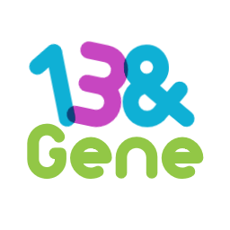
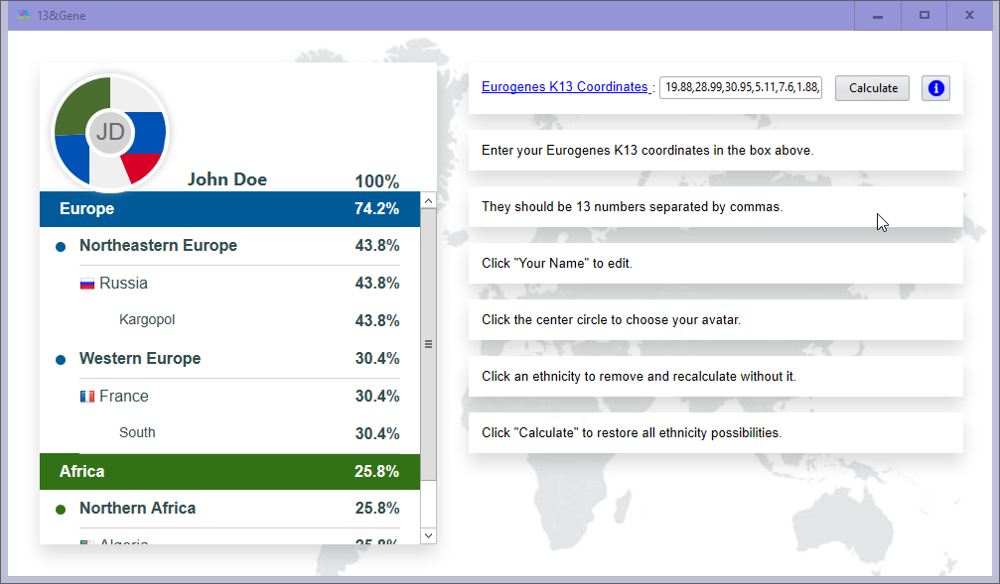
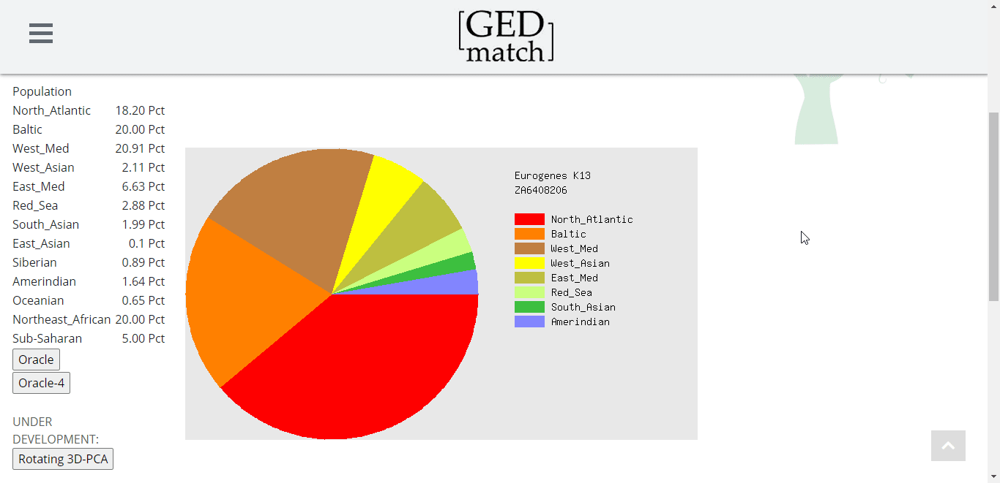

<h1 align="center">
  <a href="https://github.com/girkovarpa/13-and-Gene">
    
  </a>
  <br />
  13&Gene
  <br />
</h1>

<h3 align="center">
  Oracle for Eurogenes K13
</h3>

<h1 align="center">
  <a href="https://github.com/girkovarpa/13-and-Gene">
    
  </a>
</h1>

## About

13&Gene is a fun oracle for the Eurogenes K13 calculator, available at [GEDmatch](https://www.gedmatch.com/).  It's styled in the spirit of [23andMe](https://blog.23andme.com/ancestry-reports/23andme-updates-ancestry-composition/)'s interface, and relies on [Admixture JS](https://vahaduo.github.io/vahaduo) by [Vahaduo](https://github.com/vahaduo) for super fast calculation.

Unhappy with any ethnicity result? Click it to remove it from the calculation!

The wheel is composed of your countries' flags, instead of arbitrary colors.


## Help Wanted

[k13-sources.json](resources/json/k13-sources.json) is VERY incomplete.  Only regions with a continent specified are available to the calculator, and flags are displayed only for those with a country corresponding to a flag filename.

Feel free to fill in missing ethnicity metadata, or correct any errors.

## Building

```sh
cargo build
```

## Dependencies

- [sciter.dll v4.4.8.18](https://github.com/c-smile/sciter-js-sdk/blob/fed8970ea11190d1a429809e1a004cf094fb7e03/bin/windows/x64/sciter.dll)

## Example

<h1 align="center">
  <a href="https://github.com/girkovarpa/13-and-Gene">
    
  </a>
</h1>